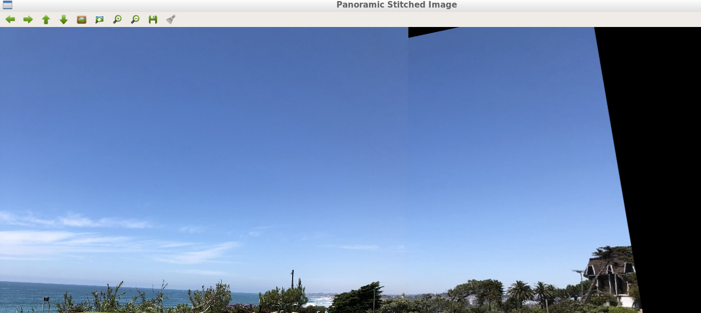

# CppND-Panorama-Stitching-Capstone-Project
Panorama Stitching Capstone Project

## Overview
This is the capstone project for the [Udacity C++ Nanodegree Program](https://www.udacity.com/course/c-plus-plus-nanodegree--nd213). I implemented a Panorama Stitcher program using OpenCV. The program read two image file and then performs Panorama Stitching operation on them. 

This technique is often called feature based-image alignment because in this technique a sparse set of features are detected in one image and matched with the features in the other image. A transformation ( Homography ) is then calculated based on these matched features that warps one image on to the other. We have already seen in the previous chapter how we can use Homography between two images to align one image w.r.t another.

Once, the second image is aligned with respect to the first image, we can simply stitch the first image with the aligned second image to get a Panoram.

Creating Panorama in OpenCV for 2 images consists of the following steps :

1. Find Keypoints and Descriptors for both images.
2. Find Corresponding points by matching their Descriptors.
3. Align second image with respect to first image using Homography.
4. Warp the second image using Perspective Transformation.
5. Combine the first image with the warped image to get the Panorama.

## File Structure

This repository contains:
- `build` : Contains all build files for the program execution.

- `images` : images folders containssome example images that used for panorama stitching. 

- `src` : Source folder Contains the `Panorama_Stitching.cpp files.

- `CMakeLists.txt` : cmake configuration file

- `README.md` : Contains directions for downloading the repository and executing the files

## Dependencies for Running Locally
* cmake >= 3.7
  * All OSes: [click here for installation instructions](https://cmake.org/install/)
* make >= 4.1 (Linux, Mac), 3.81 (Windows)
  * Linux: make is installed by default on most Linux distros
  * Mac: [install Xcode command line tools to get make](https://developer.apple.com/xcode/features/)
  * Windows: [Click here for installation instructions](http://gnuwin32.sourceforge.net/packages/make.htm)
* OpenCV >= 4.1.x
  * The OpenCV 4.1.0 source code can be found [here](https://github.com/opencv/opencv/master)
* gcc/g++ >= 5.4
  * Linux: gcc / g++ is installed by default on most Linux distros
  * Mac: same deal as make - [install Xcode command line tools](https://developer.apple.com/xcode/features/)
  * Windows: recommend using [MinGW](http://www.mingw.org/)

  **! This repository has been successfully built and tested on Ubuntu 18.08 with OpenCV 4.1 running C++14.**

## Build Instructions

1. Clone this repo using `git clone https://github.com/BV-Pradeep/CppND-Panorama-Stitching-Capstone-Project.git`

2. Enter the root directory of the repository using `cd CppND-Panorama-Stitching-Capstone-Project`
3. Remove build directory using `rm -rf build`
4. Create a new build directory using `mkdir build && cd build`
5. Compile the program in build directory using `cmake .. & make`
**! If make fails due to !_src assertion error check the file paths in Panorama_stitching.cpp file in line 12 and 15 they have to contaian full path to image.**
6.  Once Program is succesfully compiled, to run the Panorama Stitcher execute in build directory`./Panorama_Stitching`.
7. Press Enter in the Final window to exit the Program.
8. Change the scene picture numbers in lines 12 and 15 in Panrama_Stitching.cpp to check different images.

The executable(`Panorama_Sticthing`) is created in the current directory(`build`).

## Reference

[1] https://en.wikipedia.org/wiki/Panorama
[2] https://en.wikipedia.org/wiki/Image_stitching
[3] https://towardsdatascience.com/image-panorama-stitching-with-opencv-2402bde6b46c
[4] https://medium.com/pylessons/image-stitching-with-opencv-and-python-1ebd9e0a6d78
