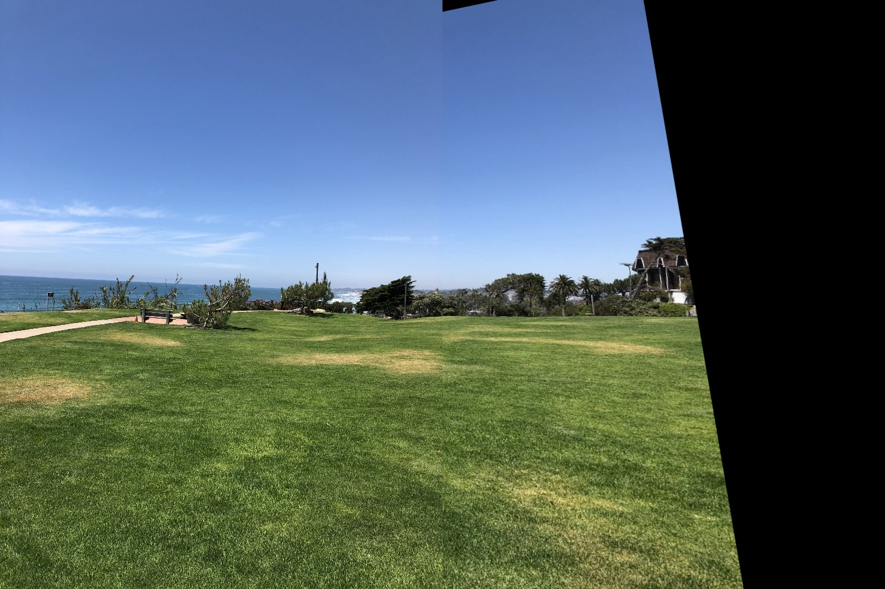

# CppND-Panorama-Stitching-Capstone-Project
Panorama Stitching Capstone Project
#### Individual Images
|Image - 1 : scene1.jpg | Image -2 : scene3.jpg |
|-- | -- |
|||

#### Panoramic Stitched Image

## Overview
This is the capstone project for the [Udacity C++ Nanodegree Program](https://www.udacity.com/course/c-plus-plus-nanodegree--nd213). I implemented a Panorama Stitcher program using OpenCV. The program read two image file and then performs Panorama Stitching operation on them. 

This technique is often called feature based-image alignment because in this technique a sparse set of features are detected in one image and matched with the features in the other image. A transformation ( Homography ) is then calculated based on these matched features that warps one image on to the other. We have already seen in the previous chapter how we can use Homography between two images to align one image w.r.t another.

Once, the second image is aligned with respect to the first image, we can simply stitch the first image with the aligned second image to get a Panorama.

Creating Panorama in OpenCV for 2 images consists of the following steps :

1. Find Keypoints and Descriptors for both images.
2. Find Corresponding points by matching their Descriptors.
3. Align second image with respect to first image using Homography.
4. Warp the second image using Perspective Transformation.
5. Combine the first image with the warped image to get the Panorama.

## File Structure

This repository contains:
- `build` : Contains all build files for the program execution.

- `images` : images folders contains some example images that used for panorama stitching. 

- `include` : contains the preprocessor header file.

- `src` : Source folder Contains the `Panorama_Stitching.cpp and preprocessor.cpp files.

- `CMakeLists.txt` : cmake configuration file

- `README.md` : Contains directions for downloading the repository and executing the files

## Dependencies for Running Locally
* cmake >= 3.7
  * All OSes: [click here for installation instructions](https://cmake.org/install/)
* make >= 4.1 (Linux, Mac), 3.81 (Windows)
  * Linux: make is installed by default on most Linux distros
  * Mac: [install Xcode command line tools to get make](https://developer.apple.com/xcode/features/)
  * Windows: [Click here for installation instructions](http://gnuwin32.sourceforge.net/packages/make.htm)
* OpenCV >= 4.1.x
  * The OpenCV 4.1.0 source code can be found [here](https://github.com/opencv/opencv/master)
* gcc/g++ >= 5.4
  * Linux: gcc / g++ is installed by default on most Linux distros
  * Mac: same deal as make - [install Xcode command line tools](https://developer.apple.com/xcode/features/)
  * Windows: recommend using [MinGW](http://www.mingw.org/)

  **! This repository has been successfully built and tested on Ubuntu 18.08 with OpenCV 4.1 running C++17.**

## Build Instructions

1. Clone this repo using `git clone https://github.com/BV-Pradeep/CppND-Panorama-Stitching-Capstone-Project.git`

2. Enter the root directory of the repository using `cd CppND-Panorama-Stitching-Capstone-Project`
3. Remove build directory using `rm -rf build`
4. Create a new build directory using `mkdir build && cd build`
5. Compile the program in build directory using `cmake .. & make`
6. Once Program is succesfully compiled, the executable(`Panorama_Sticthing`) is created in the current directory(`build`).

## Run

In `build` directory, run the executable as shown below:
Enter the following command in terminal

`./Panorama_Stitching <full-path-to-imagefile-1> <full-path-to-imagefile-2>`

- `<full-path-to-imagefile>` is the **absolute file path with no preceding space** to the image you want to input. 

**Note - Space between two file paths is necessary for parsing the two inputs, if no space is present the program interpets it is a single input and execution stops due to insuffient number of inputs.**

#### Example

`./Panorama_Stitching /home/workspace/CppND-Panorama-Stitching-Capstone-Project/images/scene1.jpg /home/workspace/CppND-Panorama-Stitching-Capstone-Project/images/scene2.jpg`

On running the executable as per above example, first a window pops up showing the first image with title **First Image - Press Enter to close the window** which displays the first image read into the program, on pressing enter the window closes, immediately second pop up window opens showing the second image with title **Second Image - Press Enter to close the window**,
on pressing enter the window closes, third pop up window opens with title **Panoramic Stitched Image - Press Enter to close the window **, on pressing enter the window closes and program  succesfully terminates.

**Note - Press enter to terminate window , do not close the window any other way as it will result in segmentation fault and program gets aborted.**

## Rubric

__README (All Rubric Points REQUIRED)__

|DONE | CRITERIA | MEETS SPECIFICATIONS| WHERE |
|-- | -- | --| -- |
| :heavy_check_mark: | A README with instructions is included with the project |The README is included with the project and has instructions for building/running the project. If any additional libraries are needed to run the project, these are indicated with cross-platform installation instructions. You can submit your writeup as markdown or pdf.| A README.md has been included in the project repo. |
| :heavy_check_mark: | The README indicates which project is chosen. | The README describes the project you have built. The README also indicates the file and class structure, along with the expected behavior or output of the program. | README.md contains information described in the adjacent cell|
| :heavy_check_mark: | The README includes information about each rubric point addressed. | The README indicates which rubric points are addressed. The README also indicates where in the code (i.e. files and line numbers) that the rubric points are addressed. |README.md contains information described in the adjacent cell |

__Compiling and Testing (All Rubric Points REQUIRED)__

|DONE | CRITERIA | MEETS SPECIFICATIONS| WHERE |
|-- | -- | --| -- |
| :heavy_check_mark: | The submission must compile and run. | The project code must compile and run without errors. We strongly recommend using cmake and make, as provided in the starter repos. If you choose another build system, the code must compile on any reviewer platform. |The repo was succesfully cloned,compiled and executed before submission for grading|

__Loops, Functions, I/O__

|DONE | CRITERIA | MEETS SPECIFICATIONS| WHERE |
|-- | -- | --| -- |
| :heavy_check_mark: | The project demonstrates an understanding of C++ functions and control structures.| A variety of control structures are used in the project. The project code is clearly organized into functions.| Panorama_Stitching.cpp files has  if & loop conditionals in lines 11&81|
| :heavy_check_mark: | The project reads data from a file and process the data, or the program writes data to a file. | The project reads data from an external file or writes data to a file as part of the necessary operation of the program.| Panorama_stitching.cp reads & writes image files in lines 22,29&109.  |
| :heavy_check_mark: | The project accepts user input and processes the input.|The project accepts input from a user as part of the necessary operation of the program.|  Panorama_stitching.cpp parses command line arguments |

__Object Oriented Programming__

|DONE | CRITERIA | MEETS SPECIFICATIONS| WHERE |
|-- | -- | --| -- |
| :heavy_check_mark: | The project uses Object Oriented Programming techniques. | The project code is organized into classes with class attributes to hold the data, and class methods to perform tasks. | Used in Panorama_Stitching.cpp by opencv in built functions |
| :heavy_check_mark: | Classes use appropriate access specifiers for class members. | All class data members are explicitly specified as public, protected, or private.| Used in Panorama_Stitching.cpp by opencv in built functions |
| :heavy_check_mark: | Class constructors utilize member initialization lists. | All class members that are set to argument values are initialized through member initialization lists.| Used in Panorama_Stitching.cpp by opencv in built functions |
| :heavy_check_mark: | Classes abstract implementation details from their interfaces. | All class member functions document their effects, either through function names, comments, or formal documentation. Member functions do not change program state in undocumented ways.| Used in Panorama_Stitching.cpp by opencv in built functions |
| :heavy_check_mark: | Classes encapsulate behavior. | Appropriate data and functions are grouped into classes. Member data that is subject to an invariant is hidden from the user. State is accessed via member functions.| Used in Panorama_Stitching.cpp by opencv in built functions |
| | Classes follow an appropriate inheritance hierarchy. | Inheritance hierarchies are logical. Composition is used instead of inheritance when appropriate. Abstract classes are composed of pure virtual functions. Override functions are specified.| Not implemented |
|  | Overloaded functions allow the same function to operate on different parameters. | One function is overloaded with different signatures for the same function name.|Not Implemented  |
|  | Derived class functions override virtual base class functions. |One member function in an inherited class overrides a virtual base class member function.| Not implemented |
| :heavy_check_mark: | Templates generalize functions in the project. | One function is declared with a template that allows it to accept a generic parameter.| Done so with in preprocessor.h|

__Memory Management__

|DONE | CRITERIA | MEETS SPECIFICATIONS| WHERE |
|-- | -- | --| -- |
| :heavy_check_mark: | The project makes use of references in function declarations. | At least two variables are defined as references, or two functions use pass-by-reference in the project code.|Extensively done so in multiple functions in preprocessor.cpp & preprocessor.h |
|  | The project uses destructors appropriately. | At least one class that uses unmanaged dynamically allocated memory, along with any class that otherwise needs to modify state upon the termination of an object, uses a destructor. | Not implemented||
|  | The project uses scope / Resource Acquisition Is Initialization (RAII) where appropriate. | The project follows the Resource Acquisition Is Initialization pattern where appropriate, by allocating objects at compile-time, initializing objects when they are declared, and utilizing scope to ensure their automatic destruction.| Not implemented|
|  | The project follows the Rule of 5. | For all classes, if any one of the copy constructor, copy assignment operator, move constructor, move assignment operator, and destructor are defined, then all of these functions are defined.| Not implemented| |
|  | The project uses move semantics to move data, instead of copying it, where possible. | For classes with move constructors, the project returns objects of that class by value, and relies on the move constructor, instead of copying the object. | Not implemented| |
|  | The project uses smart pointers instead of raw pointers. | The project uses at least one smart pointer: unique_ptr, shared_ptr, or weak_ptr. The project does not use raw pointers.| Not implemented| 

__Concurrency__

|DONE | CRITERIA | MEETS SPECIFICATIONS| WHERE |
|-- | -- | --| -- |
| | The project uses multithreading. | The project uses multiple threads in the execution.| Not  Implemented |
|  | A promise and future is used in the project. | A promise and future is used to pass data from a worker thread to a parent thread in the project code.|Not  Implemented  |
|  | A mutex or lock is used in the project. | A mutex or lock (e.g. std::lock_guard or `std::unique_lock) is used to protect data that is shared across multiple threads in the project code.| Not Implemented |
|  | A condition variable is used in the project. | A std::condition_variable is used in the project code to synchronize thread execution.|Not Implemented|

## Reference
[1] https://en.wikipedia.org/wiki/Panorama .
[2] https://en.wikipedia.org/wiki/Image_stitching .
[3] https://towardsdatascience.com/image-panorama-stitching-with-opencv-2402bde6b46c .
[4] https://medium.com/pylessons/image-stitching-with-opencv-and-python-1ebd9e0a6d78 .
